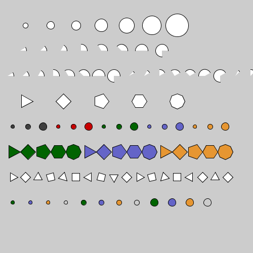

For each row of shapes in the image below, go through the following steps:

1. In a code comment, describe the family of shapes.
2. Describe what variables you will need in the data type, and the meaning of each
3. Write a class  with the necessary variables.  Make all varables `final`.
4. Are there shapes in the family that cannot be represented by the class?
5. Are there values in the class that aren't part of the family?
6. Write a constructor for the data type.
7. Write a function that draws a value of your data type.

For example, for the first row, I would write for each step:

1. Circles of various sizes
2. The radius of the circle
3. ```
class Circle {
    final float r;
    }```
4. No, every circle can be represented (up to some absurdly high radius).
5. Yes.  Negative radius doesn't make sense.  Zero is a bit unclear.
6. ```
Circle(float r_) {
   r = r_;
   }```
7. ```
   drawCircle(Circle c) {
   ellipse(0,0,c.r,c.r);
}```


